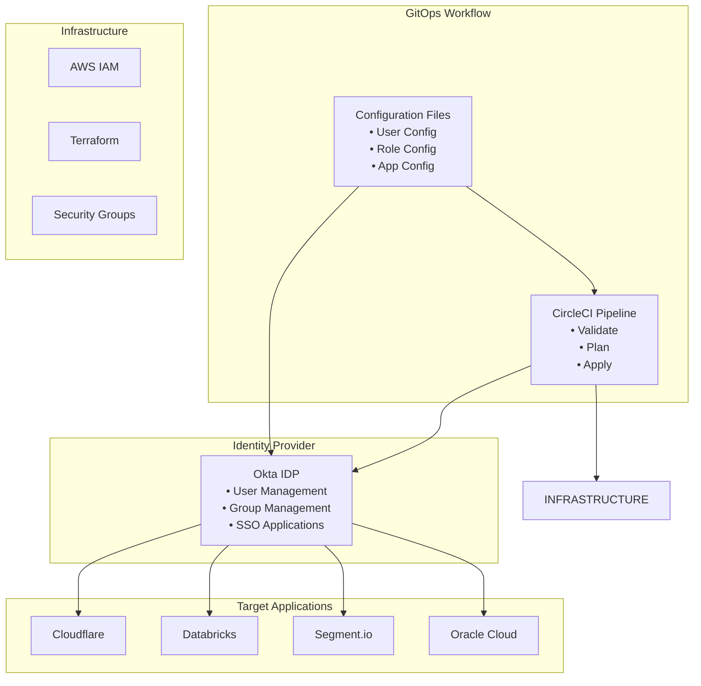
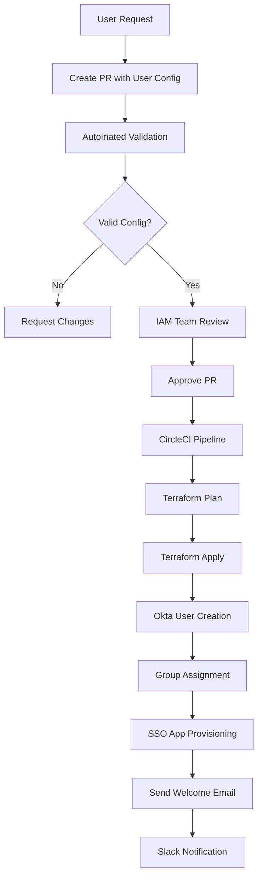
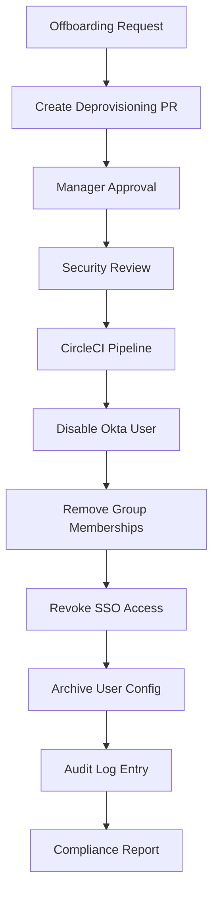

# IAM Implementation Plan

## Overview

This document outlines the comprehensive Identity and Access Management (IAM) implementation for the mini-org platform using Okta as the primary Identity Provider (IDP) with GitOps-driven user provisioning and SSO integration.

## Architecture Overview



## Implementation Requirements

### 1. Okta Integration
- **Primary IDP**: Okta for workforce identity management
- **SSO Applications**: Cloudflare, Databricks, Segment.io, Oracle Cloud
- **API Integration**: Okta Admin API for automated provisioning
- **SAML/OIDC**: Configure SSO protocols for each application

### 2. Monorepo Structure
```
packages/
└── iam/
    ├── configs/
    │   ├── users/               # User configuration files
    │   ├── groups/              # Group and role definitions
    │   ├── applications/        # SSO application configs
    │   └── policies/           # Access policies
    ├── terraform/
    │   ├── okta/               # Okta provider configurations
    │   ├── aws-iam/            # AWS IAM integration
    │   └── modules/            # Reusable IAM modules
    ├── scripts/
    │   ├── provision-user.py   # User provisioning automation
    │   ├── validate-config.py  # Configuration validation
    │   └── sync-groups.py      # Group synchronization
    └── docs/
        ├── onboarding.md       # User onboarding guide
        ├── rbac-model.md       # Role-based access control
        └── sso-setup.md        # SSO configuration guide
```

### 3. Infrastructure as Code
- **Terraform Provider**: Okta, AWS, Cloudflare
- **State Management**: Terraform Cloud with workspace separation
- **Module Structure**: Reusable modules for user, group, and application management
- **Environment Separation**: Dev, staging, production configurations

### 4. CircleCI Workflow
```yaml
# .circleci/config.yml
workflows:
  iam-pipeline:
    jobs:
      - validate-configs
      - terraform-plan
      - terraform-apply:
          requires: [validate-configs, terraform-plan]
          filters:
            branches:
              only: [main]
      - sync-users:
          requires: [terraform-apply]
      - notify-teams
```

### 5. GitOps Flow
1. **User Request**: New user submits configuration via PR
2. **Validation**: Automated checks for configuration format and policies
3. **Review**: Required approvals from IAM administrators
4. **Deployment**: CircleCI pipeline provisions user in Okta
5. **Synchronization**: User groups and applications automatically configured
6. **Notification**: Slack/email notification to user and teams

## Role-Based Access Control (RBAC)

### Core Roles

#### Admin Role
- **Scope**: Full platform access
- **Permissions**:
  - Okta admin console access
  - AWS root account permissions
  - All application admin rights
  - Infrastructure modification
- **Applications**: All SSO applications with admin privileges

#### Developer Role
- **Scope**: Development and deployment access
- **Permissions**:
  - Code repository access
  - CI/CD pipeline management
  - Development environment access
  - Application deployment
- **Applications**: 
  - Cloudflare (zones management)
  - Databricks (workspace access)
  - Segment.io (source/destination config)

#### Operator Role
- **Scope**: Production operations and monitoring
- **Permissions**:
  - Production environment read access
  - Monitoring and alerting
  - Incident response tools
  - Limited infrastructure access
- **Applications**:
  - Cloudflare (analytics, monitoring)
  - Oracle Cloud (monitoring)
  - Databricks (query access)

#### Read-Only Role
- **Scope**: View-only access for auditing and reporting
- **Permissions**:
  - Dashboard and metrics access
  - Documentation access
  - Audit log viewing
- **Applications**: All applications with read-only permissions

#### Privileged Access Role
- **Scope**: Emergency access for critical operations
- **Permissions**:
  - Break-glass access to production
  - Security incident response
  - Time-limited elevated privileges
- **Applications**: Emergency access to all applications
- **Approval**: Requires multi-person approval and justification

## Mock User Configurations

### Admin User
```yaml
# packages/iam/configs/users/admin-john-doe.yaml
apiVersion: iam.mini-org.com/v1
kind: User
metadata:
  name: john.doe
  environment: production
spec:
  profile:
    firstName: John
    lastName: Doe
    email: john.doe@mini-org.com
    department: Platform Engineering
    title: Platform Administrator
  roles:
    - admin
  groups:
    - platform-admins
    - infrastructure-team
  applications:
    - cloudflare-admin
    - databricks-admin
    - segment-admin
    - oracle-admin
  mfaRequired: true
  sessionTimeout: 8h
```

### Developer User
```yaml
# packages/iam/configs/users/dev-jane-smith.yaml
apiVersion: iam.mini-org.com/v1
kind: User
metadata:
  name: jane.smith
  environment: production
spec:
  profile:
    firstName: Jane
    lastName: Smith
    email: jane.smith@mini-org.com
    department: Engineering
    title: Senior Developer
  roles:
    - developer
  groups:
    - developers
    - frontend-team
  applications:
    - cloudflare-developer
    - databricks-workspace
    - segment-developer
  mfaRequired: true
  sessionTimeout: 12h
```

### Operator User
```yaml
# packages/iam/configs/users/ops-mike-wilson.yaml
apiVersion: iam.mini-org.com/v1
kind: User
metadata:
  name: mike.wilson
  environment: production
spec:
  profile:
    firstName: Mike
    lastName: Wilson
    email: mike.wilson@mini-org.com
    department: Operations
    title: Site Reliability Engineer
  roles:
    - operator
  groups:
    - operations
    - sre-team
  applications:
    - cloudflare-analytics
    - oracle-monitoring
    - databricks-queries
  mfaRequired: true
  sessionTimeout: 10h
```

## SSO Application Configurations

### Cloudflare
```yaml
# packages/iam/configs/applications/cloudflare.yaml
apiVersion: iam.mini-org.com/v1
kind: Application
metadata:
  name: cloudflare
spec:
  type: saml
  entityId: cloudflare.com
  ssoUrl: https://cloudflare.com/sso/saml
  audienceRestriction: cloudflare.com
  roleMapping:
    admin: Cloudflare:Administrator
    developer: Cloudflare:User
    operator: Cloudflare:Analytics
    read-only: Cloudflare:ReadOnly
```

### Databricks
```yaml
# packages/iam/configs/applications/databricks.yaml
apiVersion: iam.mini-org.com/v1
kind: Application
metadata:
  name: databricks
spec:
  type: oidc
  clientId: databricks-client-id
  redirectUri: https://databricks.com/auth/callback
  scopes: [openid, email, profile]
  roleMapping:
    admin: databricks-admin
    developer: databricks-user
    operator: databricks-analyst
    read-only: databricks-viewer
```

### Segment.io
```yaml
# packages/iam/configs/applications/segment.yaml
apiVersion: iam.mini-org.com/v1
kind: Application
metadata:
  name: segment
spec:
  type: saml
  entityId: segment.io
  ssoUrl: https://segment.io/sso/saml
  roleMapping:
    admin: segment-admin
    developer: segment-developer
    read-only: segment-viewer
```

### Oracle Cloud
```yaml
# packages/iam/configs/applications/oracle-cloud.yaml
apiVersion: iam.mini-org.com/v1
kind: Application
metadata:
  name: oracle-cloud
spec:
  type: saml
  entityId: oracle.com
  ssoUrl: https://oracle.com/fed
  roleMapping:
    admin: OCI-Administrator
    operator: OCI-Monitor
    read-only: OCI-ReadOnly
    privileged: OCI-EmergencyAccess
```

## GitOps Workflow Implementation

### 1. User Provisioning Process


### 2. Deprovisioning Process


## Security Considerations

### 1. Access Controls
- **Principle of Least Privilege**: Users receive minimum necessary access
- **Time-bound Access**: Privileged roles have automatic expiration
- **Multi-factor Authentication**: Required for all users
- **Session Management**: Configurable timeout policies

### 2. Audit and Compliance
- **Activity Logging**: All IAM operations logged in Okta and AWS CloudTrail
- **Regular Reviews**: Quarterly access reviews for all users
- **Compliance Reports**: Automated generation for SOC2, ISO27001
- **Change Tracking**: Git history provides complete audit trail

### 3. Emergency Procedures
- **Break-glass Access**: Emergency admin access with approval workflow
- **Incident Response**: Automated user suspension capabilities
- **Recovery Procedures**: Documented processes for system recovery

## Implementation Timeline

### Phase 1: Foundation (Weeks 1-2)
- [ ] Set up Okta tenant and basic configuration
- [ ] Create Terraform modules for Okta provider
- [ ] Implement basic user and group management
- [ ] Set up CircleCI pipeline

### Phase 2: SSO Integration (Weeks 3-4)
- [ ] Configure Cloudflare SSO
- [ ] Configure Databricks SSO
- [ ] Configure Segment.io SSO
- [ ] Configure Oracle Cloud SSO

### Phase 3: GitOps Implementation (Weeks 5-6)
- [ ] Implement configuration validation
- [ ] Create user provisioning automation
- [ ] Set up approval workflows
- [ ] Implement notification systems

### Phase 4: Testing and Documentation (Weeks 7-8)
- [ ] Create mock users for testing
- [ ] End-to-end testing of provisioning flow
- [ ] Security review and penetration testing
- [ ] Complete documentation and runbooks

## Success Metrics

### Operational Metrics
- **Provisioning Time**: < 1 hour for new user onboarding
- **Error Rate**: < 1% failed provisioning attempts
- **Self-Service**: 90% of requests automated without manual intervention
- **Compliance**: 100% audit trail coverage

### Security Metrics
- **MFA Adoption**: 100% of users
- **Access Reviews**: Completed within SLA (30 days)
- **Incident Response**: < 15 minutes for emergency access suspension
- **Policy Violations**: < 0.1% monthly

## Maintenance and Operations

### Regular Tasks
- **Weekly**: Review new user requests and approvals
- **Monthly**: Access review reports and cleanup
- **Quarterly**: Full security review and policy updates
- **Annually**: Disaster recovery testing

### Monitoring and Alerting
- **Failed Logins**: Alert on multiple failed attempts
- **Privileged Access**: Alert on emergency access usage
- **Configuration Changes**: Alert on unauthorized modifications
- **API Limits**: Monitor Okta API usage and limits

## Cost Estimation

### Okta Licensing
- **Workforce Identity**: $2/user/month (estimated 50 users = $100/month)
- **SSO Applications**: Included in workforce identity
- **API Calls**: Included in base plan

### Infrastructure Costs
- **Terraform Cloud**: Free tier sufficient for team size
- **CircleCI**: Free tier with 2,500 credits/month
- **AWS IAM**: No additional cost for IAM service

**Total Estimated Cost**: $100-150/month for 50 users

## Risk Assessment and Mitigation

### High Risks
1. **Single Point of Failure**: Okta outage impacts all access
   - **Mitigation**: Emergency break-glass procedures and backup authentication
2. **Configuration Errors**: Incorrect role assignments
   - **Mitigation**: Automated validation and peer review process
3. **Privilege Escalation**: Users gaining unauthorized access
   - **Mitigation**: Regular access reviews and monitoring

### Medium Risks
1. **API Rate Limiting**: Okta API limits during bulk operations
   - **Mitigation**: Implement rate limiting and batch processing
2. **Integration Failures**: SSO application configuration issues
   - **Mitigation**: Health checks and automated testing

## Conclusion

This IAM implementation plan provides a comprehensive, scalable, and secure identity management solution for the mini-org platform. The GitOps-driven approach ensures consistency, auditability, and automation while maintaining security best practices and compliance requirements.

The modular design allows for incremental implementation and future expansion as the organization grows. Regular reviews and updates will ensure the system remains effective and secure over time.