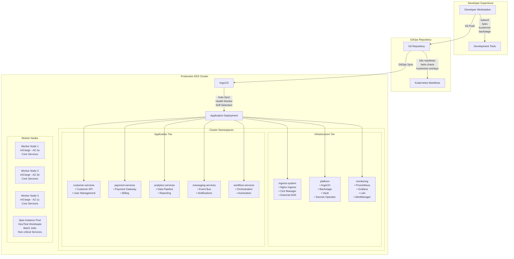
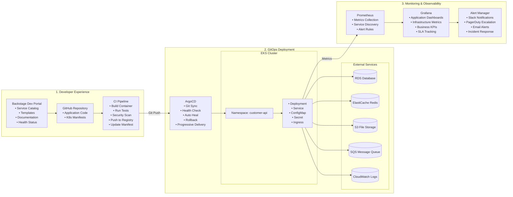
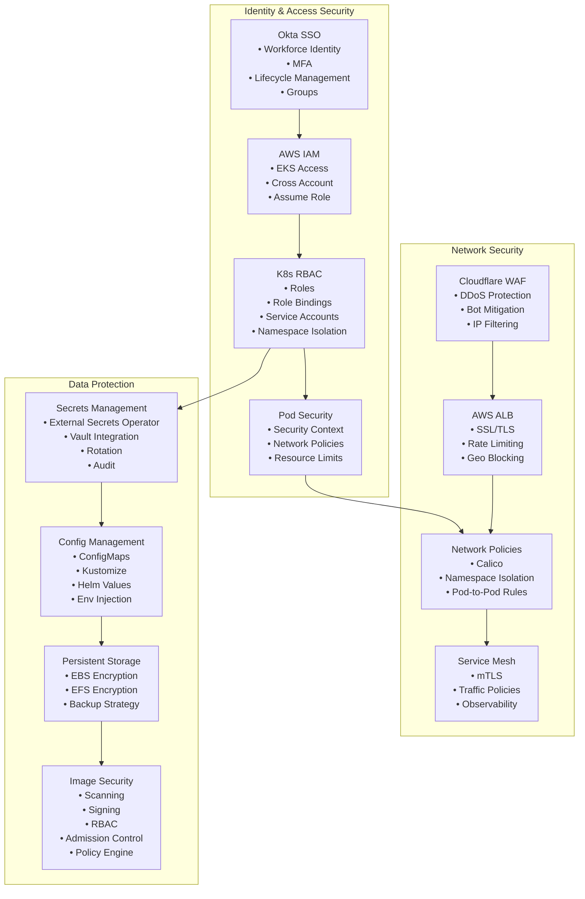
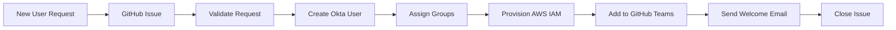

# Platform Architecture Implementation Plan

## Executive Summary

This document outlines a comprehensive platform architecture using a **managed services first** approach, prioritizing free tiers and open-source solutions to demonstrate enterprise capabilities with minimal operational overhead.

## Architecture Principles

1. **Managed Services First**: Minimize infrastructure management
2. **Free Tier Optimization**: Leverage generous free tiers from major providers
3. **GitOps**: All changes through version control and automation
4. **Infrastructure as Code**: Reproducible, versioned infrastructure
5. **Self-Service**: Enable teams to provision resources independently

## Application Reference Model


### Layer Overview

#### 1. Customer Facing Applications
- **Web Application**: React/Next.js SPA for customer portal
- **Mobile Application**: Native iOS/Android or React Native
- **Public API**: REST/GraphQL APIs with developer portal
- **Partner Portal**: B2B integration and vendor management
- **Marketing Site**: CMS-based landing pages

#### 2. Internal Applications
- **Admin Portal**: Operations management and user support
- **Employee Portal**: HR self-service, time & expense
- **Developer Portal**: Backstage for service catalog
- **Analytics Portal**: BI dashboards and reports
- **Finance Portal**: Billing, invoicing, revenue management
- **Ops Tools**: Monitoring and incident management

#### 3. Business Services
- **Customer Service**: Account management, profiles, preferences, support
- **Order Service**: Cart, order processing, fulfillment, returns
- **Payment Service**: Payment gateway, billing, invoicing, subscriptions
- **Product Service**: Catalog, inventory, pricing, recommendations
- **Marketing Service**: Campaigns, email/SMS, promotions, loyalty
- **Analytics Service**: Event tracking, metrics, reporting, ML/AI

#### 4. Platform Services
- **Identity Service**: Authentication, SSO, user management
- **API Gateway**: Rate limiting, API security
- **Messaging**: Event bus, notifications
- **Workflow Engine**: Orchestration, automation
- **File Storage**: Object storage, CDN
- **Search Service**: Full-text and faceted search
- **Cache**: Redis, session store

#### 5. Data Services
- **Operational DB**: PostgreSQL/MySQL, MongoDB
- **Data Warehouse**: Snowflake/BigQuery
- **Data Lake**: S3/GCS raw data store
- **ETL Pipeline**: Fivetran/Airbyte, dbt
- **Stream Processing**: Kafka/Kinesis real-time
- **ML Platform**: SageMaker, Databricks

## Technology Capability Model


### Capability Areas

#### 1. Edge & Security
- **Provider**: Cloudflare (Free tier)
- **Capabilities**: CDN, WAF, Zero Trust, API Gateway, SSL/TLS, Bot Protection
- **Benefits**: Global edge network, DDoS protection, integrated security

#### 2. Identity & Access Management
- **Workforce IAM**: Okta (Free up to 1,000 MAU)
  - SSO, MFA, SCIM provisioning
  - Google Workspace, Azure AD integration
- **Customer IAM**: Auth0 (7,000 MAU free) or AWS Cognito
  - Social login, passwordless, progressive profiling
- **API Security**: JWT/OAuth2, API keys
- **RBAC**: Fine-grained permissions, policy engine

#### 3. Infrastructure & Platform
- **Cloud Provider**: AWS (Free tier, multi-region)
- **Container Platform**: EKS managed Kubernetes, Fargate serverless
- **IaC**: Terraform Cloud, GitOps with ArgoCD
- **Serverless**: Lambda, API Gateway
- **CI/CD**: GitHub Actions, GitLab CI
- **Service Mesh**: Istio/App Mesh (optional)

#### 4. Data & Analytics
- **Data Lake**: S3/GCS with Parquet/Delta formats
- **Data Warehouse**: Snowflake trial or BigQuery free tier
- **ETL/ELT**: Fivetran free tier, Airbyte OSS
- **Transformation**: dbt Cloud free tier
- **BI/Visualization**: Looker Studio, Metabase
- **ML Platform**: SageMaker, Databricks trial

#### 5. Customer Experience
- **CDP**: Segment free tier or RudderStack OSS
- **Analytics**: Amplitude free tier, Google Analytics
- **A/B Testing**: LaunchDarkly, Split.io
- **Personalization**: Dynamic Yield, Optimizely
- **Communication**: SendGrid free tier, Twilio
- **Support**: Intercom, Zendesk

#### 6. Business Applications
- **CRM**: HubSpot free tier (unlimited users)
- **ERP/Finance**: Zoho Books, Wave (free)
- **Payments**: Stripe, PayPal
- **Marketing**: Mailchimp, Brevo free tier
- **HR/Payroll**: Gusto, BambooHR
- **Collaboration**: Slack free tier, MS Teams

#### 7. Engineering Platform
- **Dev Portal**: Backstage (self-hosted on EKS)
- **Monitoring**: Datadog free tier, New Relic
- **Logging**: CloudWatch, LogDNA
- **APM**: AppDynamics, Dynatrace
- **Incident Management**: PagerDuty free tier, Opsgenie
- **Documentation**: Confluence, GitBook

## Kubernetes Architecture

### Container Platform Overview

The Kubernetes architecture follows a GitOps-first approach with managed EKS and comprehensive application lifecycle management.



### Application Deployment Flow



### Namespace Organization

```yaml
# kubernetes/base/namespaces.yaml
apiVersion: v1
kind: Namespace
metadata:
  name: platform
  labels:
    purpose: platform-services
    tier: infrastructure
---
apiVersion: v1
kind: Namespace
metadata:
  name: ingress-system
  labels:
    purpose: ingress-controllers
    tier: infrastructure
---
apiVersion: v1
kind: Namespace
metadata:
  name: monitoring
  labels:
    purpose: observability
    tier: infrastructure
---
apiVersion: v1
kind: Namespace
metadata:
  name: customer-services
  labels:
    purpose: business-services
    tier: application
---
apiVersion: v1
kind: Namespace
metadata:
  name: internal-services
  labels:
    purpose: internal-tools
    tier: application
```

### Security Architecture



### Repository Structure for Kubernetes

```
packages/
└── kubernetes/
    ├── package.json              # Package definition
    ├── README.md                 # Documentation
    ├── base/                     # Base Kustomize configurations
    │   ├── kustomization.yaml    # Base kustomization
    │   ├── namespaces.yaml       # Namespace definitions
    │   ├── rbac.yaml            # RBAC configurations
    │   └── network-policies.yaml # Network security
    ├── overlays/                 # Environment-specific overlays
    │   ├── dev/
    │   │   ├── kustomization.yaml
    │   │   ├── resource-quotas.yaml
    │   │   └── ingress-patch.yaml
    │   ├── staging/
    │   │   ├── kustomization.yaml
    │   │   ├── hpa-patch.yaml
    │   │   └── monitoring-config.yaml
    │   └── production/
    │       ├── kustomization.yaml
    │       ├── security-policies.yaml
    │       ├── backup-config.yaml
    │       └── disaster-recovery.yaml
    ├── applications/             # ArgoCD Application definitions
    │   ├── platform/
    │   │   ├── argocd.yaml
    │   │   ├── backstage.yaml
    │   │   ├── external-secrets.yaml
    │   │   └── cert-manager.yaml
    │   ├── monitoring/
    │   │   ├── prometheus.yaml
    │   │   ├── grafana.yaml
    │   │   ├── loki.yaml
    │   │   └── alert-manager.yaml
    │   └── business-services/
    │       ├── customer-api.yaml
    │       ├── payment-service.yaml
    │       ├── analytics-service.yaml
    │       └── notification-service.yaml
    ├── charts/                   # Helm charts for complex applications
    │   ├── backstage/
    │   ├── monitoring-stack/
    │   └── business-service-template/
    └── scripts/                  # Automation and utilities
        ├── setup-cluster.sh
        ├── deploy-app.sh
        ├── backup-restore.sh
        └── security-scan.sh
```

### Platform Services Configuration

```yaml
# packages/kubernetes/applications/platform/backstage.yaml
apiVersion: argoproj.io/v1alpha1
kind: Application
metadata:
  name: backstage
  namespace: argocd
spec:
  project: platform
  source:
    repoURL: https://github.com/c2pig/mini-org.git
    path: packages/kubernetes/charts/backstage
    targetRevision: main
    helm:
      values: |
        backstage:
          image:
            repository: backstage/backstage
            tag: latest
          ingress:
            enabled: true
            annotations:
              cert-manager.io/cluster-issuer: letsencrypt-prod
              nginx.ingress.kubernetes.io/ssl-redirect: "true"
            hosts:
              - host: backstage.mini-org.com
                paths:
                  - path: /
                    pathType: Prefix
        postgresql:
          enabled: true
          persistence:
            enabled: true
            size: 20Gi
  destination:
    server: https://kubernetes.default.svc
    namespace: platform
  syncPolicy:
    automated:
      prune: true
      selfHeal: true
    syncOptions:
      - CreateNamespace=true
```

### Monitoring Stack

```yaml
# packages/kubernetes/applications/monitoring/prometheus.yaml
apiVersion: argoproj.io/v1alpha1
kind: Application
metadata:
  name: prometheus-stack
  namespace: argocd
spec:
  project: monitoring
  source:
    repoURL: https://prometheus-community.github.io/helm-charts
    chart: kube-prometheus-stack
    targetRevision: "51.2.0"
    helm:
      values: |
        prometheus:
          prometheusSpec:
            retention: 30d
            storageSpec:
              volumeClaimTemplate:
                spec:
                  storageClassName: gp3
                  accessModes: ["ReadWriteOnce"]
                  resources:
                    requests:
                      storage: 100Gi
        grafana:
          enabled: true
          adminPassword: "${GRAFANA_ADMIN_PASSWORD}"
          ingress:
            enabled: true
            annotations:
              cert-manager.io/cluster-issuer: letsencrypt-prod
            hosts:
              - grafana.mini-org.com
        alertmanager:
          alertmanagerSpec:
            storage:
              volumeClaimTemplate:
                spec:
                  storageClassName: gp3
                  accessModes: ["ReadWriteOnce"]
                  resources:
                    requests:
                      storage: 20Gi
  destination:
    server: https://kubernetes.default.svc
    namespace: monitoring
  syncPolicy:
    automated:
      prune: true
      selfHeal: true
    syncOptions:
      - CreateNamespace=true
```

### Self-Service Application Template

```yaml
# packages/kubernetes/charts/business-service-template/templates/deployment.yaml
apiVersion: apps/v1
kind: Deployment
metadata:
  name: {{ .Values.service.name }}
  namespace: {{ .Values.service.namespace }}
  labels:
    app: {{ .Values.service.name }}
    version: {{ .Values.service.version }}
    team: {{ .Values.service.team }}
spec:
  replicas: {{ .Values.replicas }}
  selector:
    matchLabels:
      app: {{ .Values.service.name }}
  template:
    metadata:
      labels:
        app: {{ .Values.service.name }}
        version: {{ .Values.service.version }}
    spec:
      serviceAccountName: {{ .Values.service.name }}
      securityContext:
        runAsNonRoot: true
        runAsUser: 1001
        fsGroup: 1001
      containers:
      - name: {{ .Values.service.name }}
        image: {{ .Values.image.repository }}:{{ .Values.image.tag }}
        ports:
        - containerPort: {{ .Values.service.port }}
        env:
        - name: PORT
          value: "{{ .Values.service.port }}"
        - name: ENVIRONMENT
          value: {{ .Values.environment }}
        envFrom:
        - secretRef:
            name: {{ .Values.service.name }}-secrets
        - configMapRef:
            name: {{ .Values.service.name }}-config
        resources:
          requests:
            memory: {{ .Values.resources.requests.memory }}
            cpu: {{ .Values.resources.requests.cpu }}
          limits:
            memory: {{ .Values.resources.limits.memory }}
            cpu: {{ .Values.resources.limits.cpu }}
        livenessProbe:
          httpGet:
            path: /health
            port: {{ .Values.service.port }}
          initialDelaySeconds: 30
          periodSeconds: 10
        readinessProbe:
          httpGet:
            path: /ready
            port: {{ .Values.service.port }}
          initialDelaySeconds: 5
          periodSeconds: 5
```

## Implementation Roadmap

### Phase 1: Foundation (Week 1-2)
1. **Identity & Access**
   - Set up Okta developer account for workforce
   - Configure Auth0/Cognito for customers
   - Establish SSO for critical services

2. **Cloud Infrastructure**
   - AWS account with proper structure
   - Terraform Cloud workspace
   - Basic networking and security groups

3. **Edge Services**
   - Cloudflare account and DNS migration
   - Configure CDN and WAF rules
   - Set up API Gateway

### Phase 2: Core Platform (Week 3-4)
1. **Container Platform**
   - Deploy EKS cluster
   - Install ArgoCD for GitOps
   - Set up Backstage developer portal

2. **CI/CD Pipeline**
   - GitHub Actions workflows
   - Container registry
   - Automated deployments

3. **Monitoring & Logging**
   - Datadog agent deployment
   - CloudWatch configuration
   - Alert rules and dashboards

### Phase 3: Business Services (Week 5-6)
1. **Data Platform**
   - S3 data lake setup
   - Fivetran connectors
   - dbt Cloud projects

2. **Customer Experience**
   - Segment/CDP integration
   - Analytics implementation
   - Communication channels

3. **Business Applications**
   - HubSpot CRM setup
   - Payment integration
   - Marketing automation

### Phase 4: Advanced Features (Week 7-8)
1. **Self-Service Capabilities**
   - Backstage templates
   - Automated provisioning
   - Service catalog

2. **Security Hardening**
   - Policy as code
   - Compliance scanning
   - Audit logging

3. **Performance Optimization**
   - CDN optimization
   - Database tuning
   - Cost monitoring

## Cost Projections

### Development Environment
- **Monthly Cost**: $0-50
- **Services**: Mostly free tiers
- **Infrastructure**: Minimal compute

### Small Production (< 100 users)
- **Monthly Cost**: $100-200
- **Services**: Free tiers + minimal paid
- **Infrastructure**: Small EKS cluster

### Medium Production (1,000 users)
- **Monthly Cost**: $500-1,000
- **Services**: Some paid tiers
- **Infrastructure**: Multi-AZ deployment

### Large Production (10,000+ users)
- **Monthly Cost**: $2,000-5,000
- **Services**: Enterprise features
- **Infrastructure**: Multi-region, auto-scaling

## Key Success Factors

1. **Start Small**: Begin with free tiers and scale as needed
2. **Automate Everything**: Reduce operational overhead
3. **Monitor Costs**: Set up billing alerts early
4. **Document Decisions**: Maintain architecture decision records
5. **Enable Self-Service**: Empower teams with templates

## Migration Strategy

### From Self-Hosted to Managed
1. **Inventory Current Services**: List all self-hosted components
2. **Map to Managed Alternatives**: Find SaaS equivalents
3. **Pilot Migration**: Start with non-critical services
4. **Data Migration**: Plan for zero-downtime migrations
5. **Cutover**: Gradual transition with rollback capability

### Vendor Lock-in Mitigation
1. **Standard Interfaces**: Use open standards (OIDC, SAML)
2. **Data Portability**: Regular exports and backups
3. **Multi-Cloud Ready**: Avoid proprietary services
4. **Open Source Fallback**: Maintain self-host option

## Governance & Compliance

### Security Controls
- **Identity**: MFA required for workforce, optional for customers
- **Network**: Zero Trust architecture, encrypted in transit
- **Data**: Encryption at rest, regular backups
- **Compliance**: SOC2, GDPR, HIPAA ready architecture

### Operational Excellence
- **Monitoring**: Real-time alerts, SLA tracking
- **Incident Response**: PagerDuty escalation
- **Change Management**: GitOps approval flows
- **Documentation**: Automated from code

## Conclusion

This architecture provides enterprise-grade capabilities while maximizing the use of free tiers and managed services. The modular design allows for gradual implementation and scaling based on actual needs.

## Appendix A: Service Selection Criteria

### Managed Service Evaluation Framework
1. **Free Tier Availability**: Generous limits for startup/small business
2. **Integration Capability**: APIs, webhooks, standard protocols
3. **Migration Path**: Clear upgrade path and data portability
4. **Community Support**: Active community, good documentation
5. **Enterprise Features**: Available when scaling is needed

### Technology Decisions

#### Why Cloudflare for Edge?
- **Free tier**: Generous bandwidth, basic WAF included
- **Integration**: Single platform for CDN, WAF, Zero Trust, API Gateway
- **Performance**: Global edge network
- **Alternative**: AWS CloudFront + WAF (more expensive)

#### Why Okta for Workforce IAM?
- **Free tier**: 1,000 MAU covers most SMB needs
- **Features**: Enterprise SSO, MFA, lifecycle management
- **Integration**: 7,000+ pre-built app integrations
- **Alternative**: Keycloak (self-hosted, more maintenance)

#### Why Auth0 for Customer IAM?
- **Free tier**: 7,000 MAU with social logins
- **Features**: Progressive profiling, passwordless
- **Developer Experience**: Excellent SDKs and documentation
- **Alternative**: AWS Cognito (cheaper at scale, less features)

#### Why AWS for Infrastructure?
- **Free tier**: 12 months generous limits
- **Ecosystem**: Broadest service selection
- **Maturity**: Most mature cloud platform
- **Alternative**: GCP (better data tools), Azure (better Microsoft integration)

## Appendix B: GitOps Workflows

### Repository Structure
```
platform/
├── infrastructure/           # Terraform code
│   ├── environments/
│   │   ├── dev/
│   │   ├── staging/
│   │   └── production/
│   ├── modules/
│   │   ├── networking/
│   │   ├── compute/
│   │   ├── data/
│   │   └── security/
│   └── terraform.tf
├── kubernetes/              # K8s manifests
│   ├── base/
│   ├── overlays/
│   └── applications/
├── .github/                 # GitHub Actions
│   ├── workflows/
│   └── CODEOWNERS
└── docs/                    # Documentation
    ├── architecture/
    ├── runbooks/
    └── decisions/
```

### Self-Service Templates

#### New Service Template
```yaml
apiVersion: scaffolder.backstage.io/v1beta3
kind: Template
metadata:
  name: new-service
spec:
  parameters:
    - title: Service Details
      properties:
        name:
          type: string
        team:
          type: string
        language:
          enum: [nodejs, python, java, go]
  steps:
    - id: create-repo
      action: github:repo:create
    - id: setup-ci
      action: github:actions:create
    - id: provision-resources
      action: terraform:apply
    - id: deploy-k8s
      action: argocd:create-app
```

### Automation Examples

#### User Onboarding


#### Service Deployment


## Appendix C: Cost Optimization Strategies

### Free Tier Maximization
1. **Development Environments**
   - Use spot instances
   - Schedule shutdown during off-hours
   - Share resources between projects

2. **Production Optimization**
   - Right-size instances
   - Use reserved instances for stable workloads
   - Implement auto-scaling

3. **Data Cost Management**
   - Lifecycle policies for S3
   - Compress and archive old data
   - Use appropriate storage classes

### Monitoring Costs
```yaml
# Example CloudWatch alarm for cost
AWSTemplateFormatVersion: '2010-09-09'
Resources:
  BillingAlarm:
    Type: AWS::CloudWatch::Alarm
    Properties:
      AlarmName: MonthlyBillingAlarm
      MetricName: EstimatedCharges
      Namespace: AWS/Billing
      Statistic: Maximum
      Period: 86400
      EvaluationPeriods: 1
      Threshold: 500
      ComparisonOperator: GreaterThanThreshold
```

## Appendix D: Security Best Practices

### Identity & Access
1. **Workforce**
   - Enforce MFA for all users
   - Regular access reviews
   - Just-in-time access for privileged operations
   - Session timeout policies

2. **Customers**
   - Risk-based authentication
   - Account takeover protection
   - Privacy-first design
   - GDPR compliance

### Network Security
1. **Zero Trust Architecture**
   - No implicit trust
   - Verify every request
   - Least privilege access
   - Micro-segmentation

2. **API Security**
   - Rate limiting per client
   - API key rotation
   - Request signing
   - Input validation

### Data Protection
1. **Encryption**
   - TLS 1.3 minimum
   - At-rest encryption
   - Key management (KMS)
   - Database encryption

2. **Compliance**
   - Audit logging
   - Data residency
   - Retention policies
   - Right to deletion

## Appendix E: Disaster Recovery

### RTO/RPO Targets
- **Critical Services**: RTO 1hr, RPO 15min
- **Important Services**: RTO 4hr, RPO 1hr
- **Standard Services**: RTO 24hr, RPO 4hr

### Backup Strategy
1. **Database Backups**
   - Automated daily snapshots
   - Point-in-time recovery
   - Cross-region replication

2. **Application State**
   - GitOps ensures reproducibility
   - Persistent volume snapshots
   - Configuration backups

3. **Testing**
   - Quarterly DR drills
   - Automated recovery testing
   - Runbook maintenance

## Getting Started Checklist

### Week 1
- [ ] Create AWS account with proper billing alerts
- [ ] Set up Cloudflare account and migrate DNS
- [ ] Configure Okta developer account
- [ ] Create GitHub organization and repositories
- [ ] Set up Terraform Cloud workspace

### Week 2
- [ ] Deploy basic networking infrastructure
- [ ] Configure identity providers (Google, Azure AD)
- [ ] Set up API Gateway on Cloudflare
- [ ] Create first GitHub Actions workflow
- [ ] Deploy monitoring agents

### Week 3
- [ ] Launch EKS cluster
- [ ] Install ArgoCD and configure GitOps
- [ ] Deploy Backstage developer portal
- [ ] Configure log aggregation
- [ ] Set up first self-service template

### Week 4
- [ ] Integrate business applications (CRM, payments)
- [ ] Configure data pipeline (Fivetran, dbt)
- [ ] Set up customer analytics
- [ ] Implement backup procedures
- [ ] Document everything

## Support & Maintenance

### Regular Tasks
- **Daily**: Monitor alerts, check costs
- **Weekly**: Review access logs, update dependencies
- **Monthly**: Security patches, access reviews
- **Quarterly**: DR testing, architecture review

### Escalation Path
1. **L1**: Automated alerts and self-healing
2. **L2**: On-call engineer via PagerDuty
3. **L3**: Platform team escalation
4. **L4**: Vendor support (for paid tiers)

## Future Considerations

### Scaling Triggers
- **Move from free to paid**: 
  - > 1,000 workforce users
  - > 7,000 customer MAU
  - > 100GB data warehouse
  
### Advanced Capabilities
- **Multi-region**: Active-active deployment
- **ML/AI**: Custom models and pipelines
- **IoT**: Edge computing integration
- **Blockchain**: Decentralized identity

### Technology Refresh
- Review quarterly for:
  - New free tier offerings
  - Better managed alternatives
  - Cost optimization opportunities
  - Security improvements

---

This architecture provides a solid foundation for demonstrating enterprise capabilities while maintaining cost efficiency through managed services and free tiers. The modular approach allows teams to start small and scale based on actual needs rather than projected requirements.